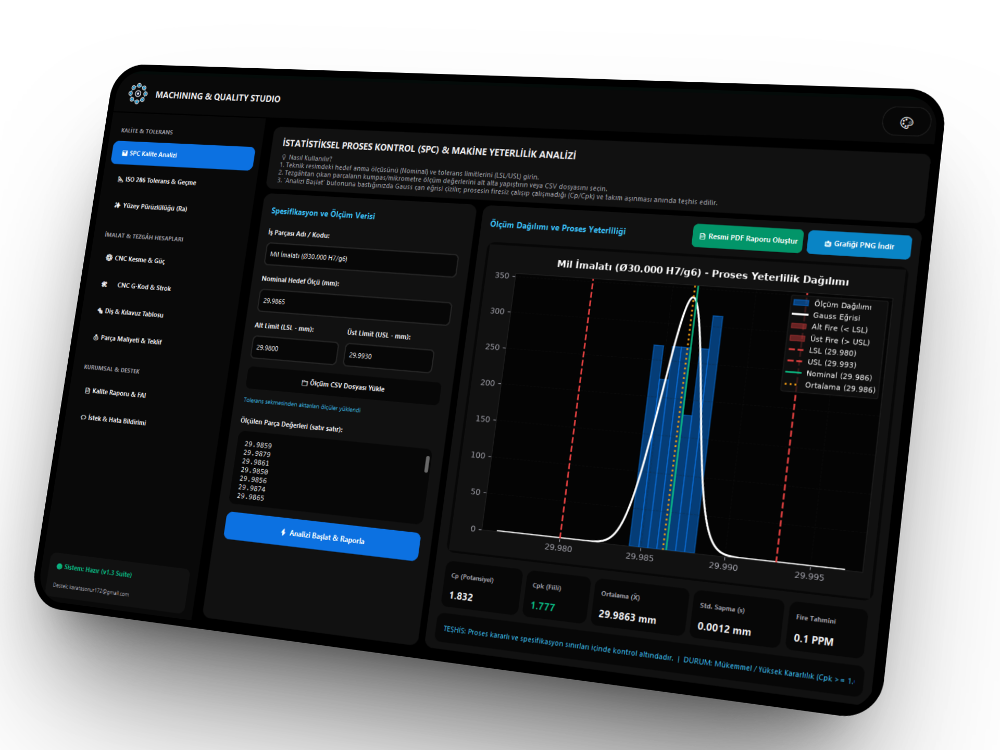

# ⚙️ Machining & Quality Studio (CNC & SPC Engineering Suite)

<p align="left">
  <a href="https://github.com/onurkaratass/machining-quality-studio/releases/latest">
    
  </a>
  
  
  
  
  <a href="https://doi.org/10.5281/zenodo.22750243"></a>
</p>


> **Talaşlı imalat atölyeleri, CNC işleme merkezleri ve kalite kontrol departmanları için geliştirilmiş; ISO 286 Tolerans & Geçme, CNC Kesme & Güç Hesabı, CNC G-Kod Simülasyonu & Strok Denetimi, Yüzey Pürüzlülüğü ($Ra$), Kılavuz & Diş Tablosu, İmalat Maliyeti & Teklif Motoru, İstatistiksel Proses Kontrol ($C_p, C_{pk}$) ve Kurumsal PDF Sertifikaları üreten hepsi-bir-arada masaüstü mühendislik istasyonu.**

---

<p align="center">
  
</p>

## 📌 Entegre Modüller

### 1. 📊 İstatistiksel Proses Kontrol (SPC & Kalite)
- **Yeterlilik Analizi:** $C_p$, $C_{pk}$, Bessel düzeltmeli standart sapma ($s$), varyans ve nominal sapma hesabı.
- **Görselleştirme:** Canlı interaktif Gauss çan eğrisi, frekans histogramı ve tolerans dışı fire alanlarının taranması.
- **Otomatik Teşhis:** Kesici takım aşınması (*tool wear*) ve tezgâh sıfırlama (*wear offset*) hatalarının otomatik tespiti.
- **Raporlama:** 300 DPI PNG grafik kaydı ve ISO 9001 / AS9100 uyumlu onaylı A4 PDF Kalite Sertifikası çıktısı.

### 2. 📐 ISO 286 Tolerans & Geçme Analizörü (Limits & Fits)
- **Standart Kütüphane:** Delik ($H6$ ila $H11$) ve mil ($c11$ ila $s6$) standart tolerans sınırları.
- **Geçme Tespiti:** Boşluklu, Sıkı (Çakma) veya Ara geçme durumunun anında tespiti ve mikron seviyesinde limitler.
- **Akıllı Aktarım:** Hesaplanan tolerans sınırlarını tek tıkla doğrudan SPC kalite modülüne aktarma.

### 3. ✨ Yüzey Pürüzlülüğü ($Ra, Rz$) ve Uç Yarıçapı Asistanı
- **Kinematik Model:** Kesici uç köşe radyüsü ($r_\epsilon$) ve ilerleme ($f$) ile teorik $R_{th}$, $Ra$ ve $Rz$ hesabı.
- **ISO Sınıflandırması:** ISO yüzey kalite sınıfı derecelendirmesi ($N1$ ila $N12$).
- **Maksimum Güvenli İlerleme:** Hedef $Ra$ pürüzlülüğü için izin verilen maksimum güvenli ilerleme ($f_{max}$) hesabı ve kesme modülüne aktarımı.
- **Mikro Profil Grafiği:** Kesici ucun parça üzerinde bıraktığı dalgaların canlı simülasyonu.

### 4. ⚙️ CNC Kesme Parametreleri & Tezgâh Gücü Hesabı
- **Operasyonlar:** CNC Frezeleme (*Milling*) ve Tornalama (*Turning*) modları.
- **Malzeme Veritabanı:** İmalat Çeliği C45, Islah Çeliği 4140, Paslanmaz 304, Alüminyum 7075, Pik Döküm GG25.
- **Kienzle Modeli:** Devir ($N$ RPM), tabla ilerlemesi ($V_f$), talaş debisi ($\text{MRR}$), net motor gücü ($P_c$ kW) ve mil torku ($M_c$ Nm).
- **Güvenlik:** Tezgâh fener milini aşırı yükleme riski erken uyarısı.

### 5. 🛠️ CNC G-Kod Simülatörü & Eksen Strok Denetleyicisi
- **Fiziksel Eksen Limitleri (Soft Limits):** X, Y, Z strok aşım denetimi; sınır aşıldığında satır numaralı kırmızı alarm.
- **Güvenlik Linter'ı:** Fener mili kapalı kesme, ilerlemesiz kesme ve Z eksi koda hızlı dalış (çarpma riski) teşhisi.
- **Takım Yolu:** Canlı 2D takım yolu çizimi (G00 hızlı yaklaşma vs G01 kesme hareketleri).
- **Metrikler:** Net kesme yolu, hızlı hareket mesafesi, parça işleme süresi (*Cycle Time*) ve takım listesi.
- **Dosya Desteği:** `.nc`, `.tap`, `.gcode`, `.txt` yükleme ve dışa aktarma.

### 6. 🔩 Standart Diş Açma, Kılavuz & Ön Delik Matkabı Tablosu
- **Kapsam:** Metrik Standart Kaba (M3 - M36), Metrik İnce ve Gaz / Boru Dişi (G / BSP).
- **Matkap Çapı:** Kesin ön delme matkap çapı ($D_{drill}$), hatve ve diş derinliği.
- **Rijit Kılavuz:** CNC Rijit Kılavuz (*Rigid Tapping*) için devirle senkronize ilerleme hızı ($F = N \times P$).

### 7. 💰 İmalat Parça Maliyeti ve Fiyat Teklifi Motoru
- **Hammadde:** Kütük hammadde ağırlığı ve malzeme maliyeti hesabı.
- **İşleme:** G-kod simülatöründen gelen işleme süresi ve tezgâh saatlik ücreti ile net işleme bedeli.
- **Fiyatlandırma:** Takım amortismanı, hazırlık işçiliği ve kâr marjı ekleme.
- **Resmi PDF:** Tek tıkla kurumsal **"Müşteri Fiyat Teklif Mektubu (PDF Quotation)"** çıktısı.

### 8. 💬 Kullanıcı İstek, Öneri & Hata Bildirimi (Feedback Hub)
- Tek tıkla doğrudan geliştiriciye (`karatasonur172@gmail.com`) yönlenen şablonlu e-posta ve panoya kopyalama desteği.

---

## 📐 Matematiksel Modeller

### 1. Kienzle Kesme Gücü ve Tork Denklemleri

$$N = \frac{1000 \cdot V_c}{\pi \cdot D}, \quad V_f = f_z \cdot z \cdot N$$

$$k_c = k_{c1.1} \cdot h_m^{-m_c}, \quad P_c = \frac{a_p \cdot a_e \cdot V_f \cdot k_c}{60 \times 10^6 \cdot \eta}$$

$$M_c = \frac{9550 \cdot P_c}{N}$$

---

### 2. Yüzey Pürüzlülüğü Kinematik Modeli

$$R_{th} = \frac{f^2}{8 \cdot r_\epsilon} \times 1000 \quad (\mu m), \quad Ra \approx \frac{R_{th}}{4}$$

$$f_{max} = \sqrt{\frac{4 \cdot Ra_{hedef} \cdot 8 \cdot r_\epsilon}{1000}}$$

---

### 3. Proses Yeterlilik İndeksleri ($C_p, C_{pk}$)

$$C_p = \frac{\text{USL} - \text{LSL}}{6s}$$

$$C_{pu} = \frac{\text{USL} - \bar{X}}{3s}, \quad C_{pl} = \frac{\bar{X} - \text{LSL}}{3s}$$

$$C_{pk} = \min(C_{pu}, C_{pl})$$

---

## 🏭 Endüstriyel Değerlendirme Kriterleri

| Cpk Değeri | Proses Durumu | İmalat Aksiyonu |
| :--- | :--- | :--- |
| **Cpk ≥ 1.67** | Mükemmel ($6\sigma$ Seviyesi) | Seri üretime mevcut parametrelerle devam edilebilir, fire < 1 PPM. |
| **1.33 ≤ Cpk < 1.67** | Yeterli ve Kararlı ($4\sigma$ Seviyesi) | Otomotiv ve talaşlı imalat kalite standartlarına uygun. |
| **1.00 ≤ Cpk < 1.33** | Sınırda / Dikkat Gerektirir | Güvenlik marjı dar. Takım aşınması ve ofsetler incelenmelidir. |
| **Cpk < 1.00** | Yetersiz / Yüksek Fire Riski | **Operasyon durdurulmalı**, kök neden analizi yapılmalıdır. |

---

## 💻 Kurulum ve Çalıştırma

### Yöntem 1: Kaynak Koddan Çalıştırma
```bash
git clone [https://github.com/onurkaratass/machining-quality-studio.git](https://github.com/onurkaratass/machining-quality-studio.git)
cd machining-quality-studio
pip install -r requirements.txt
python main.py
```

### Yöntem 2: Tek Tıkla Windows .EXE Derleme
Klasör içindeki `build_exe.bat` dosyasına çift tıklayarak Python kurulumu gerektirmeyen bağımsız `dist\Machining_Quality_Studio.exe` dosyasını oluşturabilirsiniz.

---

## 📁 Proje Dizin Yapısı

```text
machining-quality-studio/
│
├── core/
│   ├── __init__.py
│   ├── limits_fits.py        # ISO 286 tolerans ve geçme hesaplayıcı
│   ├── machining_calc.py     # Kesme parametreleri, güç, maliyet, pürüzlülük, diş ve G-kod motoru
│   ├── spc_engine.py         # Cp, Cpk, Gauss eğrisi ve takım aşınma teşhisi
│   └── pdf_exporter.py       # Kalite sertifikası ve Teklif Mektubu PDF üretici (ReportLab)
│
├── ui/
│   ├── __init__.py
│   ├── styles.py             # Koyu Lacivert, Gece Siyahı ve Açık Beyaz tema tanımları
│   ├── components.py         # ModernPillSwitch ve özel bileşenler
│   ├── splash.py             # Apple tarzı zıplayan logo açılış ekranı
│   ├── main_window.py        # Sidebar ve ana navigasyon penceresi
│   ├── tab_spc.py            # SPC ve canlı Gauss grafik sekmesi
│   ├── tab_limits.py         # ISO 286 tolerans sekmesi
│   ├── tab_surface.py        # Yüzey pürüzlülüğü sekmesi
│   ├── tab_machining.py      # CNC kesme parametreleri sekmesi
│   ├── tab_gcode.py          # CNC G-Kod simülatörü sekmesi
│   ├── tab_thread.py         # Diş ve kılavuz tablosu sekmesi
│   ├── tab_cost.py           # İmalat parça maliyeti ve teklif sekmesi
│   ├── tab_reports.py        # Kurumsal FAI raporlama sekmesi
│   └── tab_feedback.py       # İstek ve hata bildirim merkezi
│
├── assets/                   # Şeffaf büyütülmüş logo ve .ico ikonları
├── examples/
│   └── sample_measurements.csv   # Örnek CNC torna ölçüm verisi
├── tests/
│   └── test_suite.py         # Tüm modüller için otomatik birim testler
│
├── main.py                   # Uygulama ana giriş noktası
├── build_exe.bat             # Tek tıkla Windows EXE derleme betiği
├── requirements.txt          # Python bağımlılıkları
├── LICENSE                   # MIT Açık Kaynak Lisansı
└── README.md                 # Detaylı dokümantasyon
```

---

## 🧪 Testlerin Çalıştırılması

```bash
python -m unittest discover -s tests
```

---

## 📄 Lisans

Bu proje [MIT Lisansı](LICENSE) kapsamında açık kaynak olarak lisanslanmıştır.
